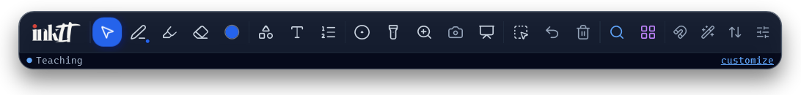
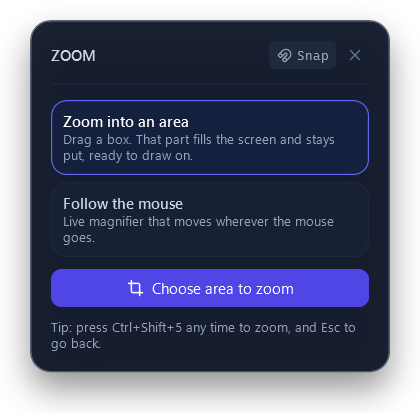
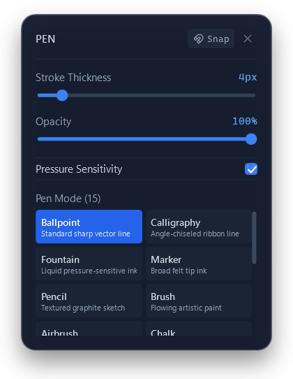
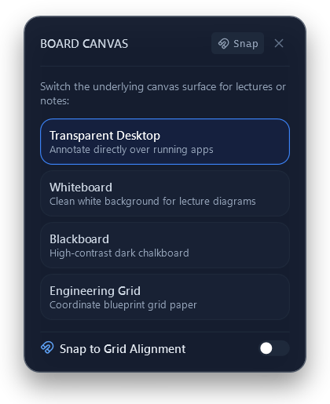

  

  <b>Draw, highlight, zoom and screenshot on top of anything on your Windows screen.</b> 
  Made for trainers, teachers and presenters, and simple enough for anyone.

  <a href="https://github.com/aishsynk/InkIt/releases/latest/download/InkIt_Setup.exe"><b>⬇ Download InkIt for Windows</b></a>
  &nbsp;·&nbsp;
  <a href="https://github.com/aishsynk/InkIt/issues/new?template=review.yml">💬 Leave a review</a>
  &nbsp;·&nbsp;
  <a href="https://github.com/aishsynk/InkIt/issues/new?template=bug.yml">🐞 Report a problem</a>

  

---

## What is InkIt?

InkIt puts a small floating toolbar on your screen. Pick the pen and draw straight over PowerPoint, a browser, code, a video call - anything. Press **Esc** and your mouse works normally again. Nothing you draw changes the apps underneath.

It is built for people who **explain things on screen**: corporate trainers, teachers, presenters, support staff and anyone sharing their screen in Teams, Zoom or Meet.

## Highlights

| | |
|---|---|
| ✏️ **Pen and highlighter** | Draw freehand with the mouse, a pen or a touch screen. 15 pen styles, see-through highlighter, pressure support. |
| 🔍 **Zoom into an area** | Drag a box around any part of the screen. It fills the screen and **stays put**, so you can point at it and draw on it. Esc takes you back. |
| 📸 **Screenshot of an area** | Drag a box. The picture is **copied at once** - paste it into Teams, PowerPoint or email with Ctrl+V - or save it as PNG/JPG. |
| 🔴 **Laser pointer and spotlight** | A glowing laser dot with a fading trail, or dim the whole screen except where your mouse is. |
| ➡️ **Shapes, text and step numbers** | Arrows, boxes, circles, text notes and numbered 1-2-3 badges for walkthroughs. |
| 🧑‍🏫 **Whiteboard** | Cover the screen with a whiteboard, blackboard or grid paper whenever you need a clean space. |
| ↩️ **Undo, select and clear** | Move, recolour or delete what you drew; Undo even brings back a Clear. |
| 🔎 **Search every feature** | Press **Ctrl+K** and type what you want - "zoom", "screenshot", "whiteboard". |
| ✨ **Smart shapes** | Draw a rough circle, box, triangle or arrow and it becomes a clean shape. A "V" at the end of a line turns it into an arrow. Undo once keeps your freehand drawing. |
| 🎬 **Record a lesson** | Record the whole screen or an area - with your drawings, pointer and voice - to an MP4 video. Pause any time. |
| 📄 **Pages and PDF handouts** | Several whiteboard pages (Page Up/Down), export them as one PDF for learners, or save them and reopen later. |
| 🖥️ **PowerPoint and second screen** | During a slide show each slide keeps its own drawings. Show the screen, an area or one window on the projector while your notes stay private. |
| 🎯 **Focus box and stamps** | Dim everything except one area while apps keep working; place ✓ ✗ ? ! ★ stamps and sticky notes. |
| ⌨️ **For experts** | Keys 1-6 for colours, [ ] for thickness, right-click tool wheel, two-finger tap undo, a shortcut for any feature, and `inkit://` links for Stream Deck and scripts. |

## Toolbar at a glance

Buttons are grouped left to right in the order you reach for them:

| Group | Buttons |
|---|---|
| **Draw** | Cursor · **Pen** · Highlighter · Eraser · Colour |
| **Add** | Shapes · Text · Step numbers |
| **Present** | Laser · Spotlight · Zoom · Screenshot · Whiteboard |
| **Edit** | Select · Undo · Clear |
| **Find** | Search · All features |

Expert switches (snap to grid, stacked assists, toolbar direction, customise) sit at the right end. Hover over any button to see what it does. The toolbar can be turned upright, moved by dragging the logo, and customised with presets (Trainer, Presenter, Diagrams, Everything).

## Keyboard shortcuts

These work in any app:

| Shortcut | Action |
|---|---|
| **Esc** | Stop drawing / close whatever is open |
| **Ctrl+Shift+5** | Zoom into an area |
| **Ctrl+Shift+4** | Screenshot of an area (copied to the clipboard) |
| **Ctrl+Shift+2** | Start / stop drawing |
| **Ctrl+Shift+Z** | Undo |
| **Ctrl+Shift+Delete** | Clear all drawings |
| **Ctrl+Shift+G** | Snap to grid on / off |
| **Alt+Shift+X** | Panic key - instantly closes every tool and overlay |

While the toolbar is active: **P** pen, **H** highlighter, **E** eraser, **S** shapes, **T** text, **N** step numbers, **V** select, **Ctrl+K** search, **F10** all features.

## Install

1. **[Download InkIt_Setup.exe](https://github.com/aishsynk/InkIt/releases/latest/download/InkIt_Setup.exe)** (always the newest version). Older versions are on the [releases page](https://github.com/aishsynk/InkIt/releases).
2. Run it. No administrator rights are needed; InkIt installs for your user account and adds a Start menu entry (and, if you like, a desktop icon).
3. If Windows shows **"Windows protected your PC"**, click **More info → Run anyway**. This appears because the installer is not code-signed yet.

**Requirements:** Windows 10 version 2004 (build 19041) or later, or Windows 11, 64-bit. Everything InkIt needs is included and it works offline. The only network request is an optional daily update check to GitHub (turn it off in Settings > About & Feedback).

To uninstall, use **Settings → Apps → InkIt → Uninstall**.

## Safe by design

- InkIt starts in **Cursor** mode: your clicks go to your apps until you pick a drawing tool.
- **Esc** always stops drawing, and **Alt+Shift+X** (panic key) closes every tool and overlay instantly, even if the toolbar is hidden.
- Nothing is uploaded: screenshots, recordings (Videos\InkIt) and saved drawings (Documents\InkIt) stay on your PC, and settings are stored in `%LOCALAPPDATA%\InkIt`.
- "Copy text from screen" uses the offline Windows OCR engine and needs a Windows OCR language pack for your language.

## Screens

  
  
  

## Versions

Releases are numbered **0.0.0.1, 0.0.0.2, 0.0.0.3 …** - each release is exactly one higher than the last, with no gaps. The version you are running is shown in **Settings** and in the tray icon tooltip; please mention it in reviews and bug reports. See [CHANGELOG.md](CHANGELOG.md) and the [releases page](https://github.com/aishsynk/InkIt/releases).

## Feedback wanted

InkIt is in early testing. The most useful feedback is:

- What you tried to do, and whether it was easy to find and use.
- Anything confusing, slow, or that got in the way of your presentation or call.
- The feature you missed most.

👉 [Leave a review](https://github.com/aishsynk/InkIt/issues/new?template=review.yml) · [Report a problem](https://github.com/aishsynk/InkIt/issues/new?template=bug.yml)

## For developers

- **Stack:** C# / WPF on .NET 8 (`net8.0-windows10.0.19041.0`), per-monitor DPI aware, no NuGet packages.
- **Build:** `dotnet build ScreenCanvas.slnx -c Release`
- **Checks:** `dotnet run --project tests/InkIt.Tests -c Release` (36 checks; run on every push by GitHub Actions)
- **Run:** `src/ScreenCanvas/bin/Release/net8.0-windows10.0.19041.0/InkIt.exe`
- **Release:** `pwsh tools/release/Release.ps1` - publishes a self-contained build stamped with the next version from `version.txt`, builds the Inno Setup installer and creates the GitHub release. See the script header for the numbering rules.
- **Layout:** `src/ScreenCanvas` (app), `packaging/installer.iss` (installer), `tools/` (icon generator, release script), `AI/` (project notes and decisions). Test evidence: [QA_RESULTS.md](QA_RESULTS.md), [FEATURE_MATRIX.md](FEATURE_MATRIX.md).

Icons are from [Lucide](https://lucide.dev) (ISC licence, see `src/ScreenCanvas/UI/Icons/LUCIDE-LICENSE.txt`).

---

 © 2026 Aishwar Nigam

